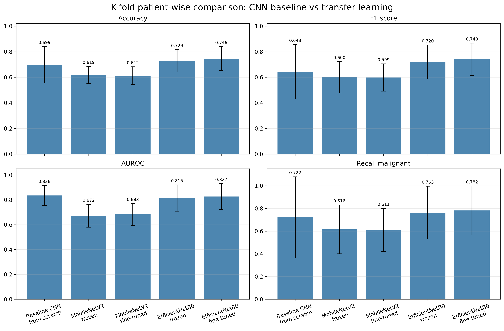
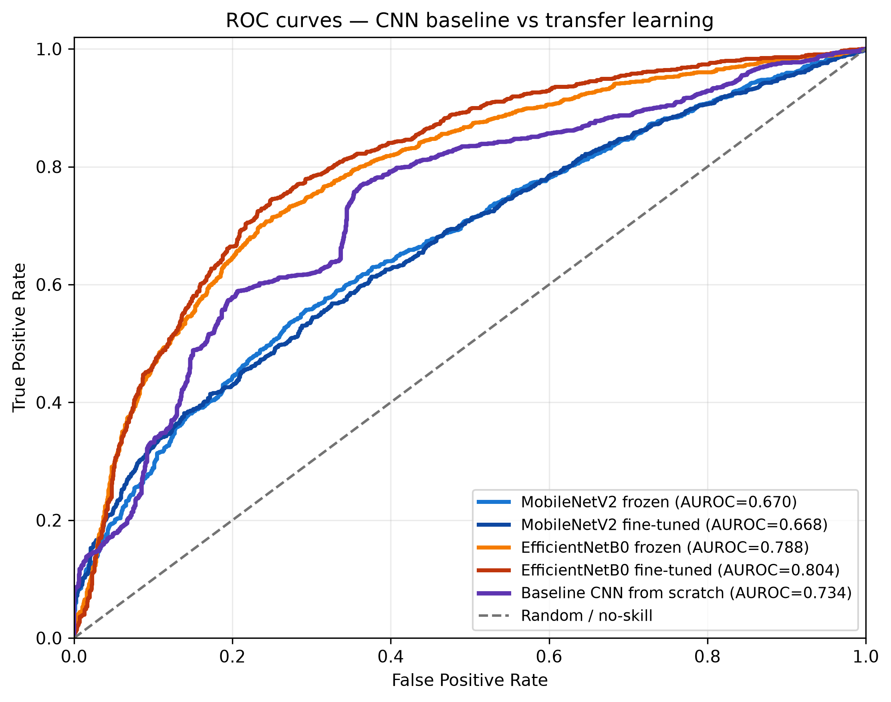
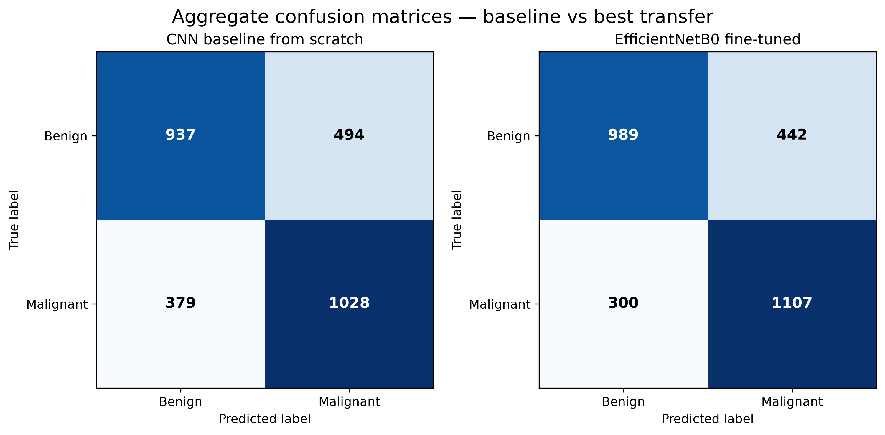
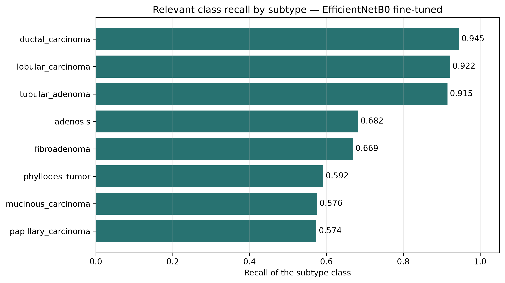
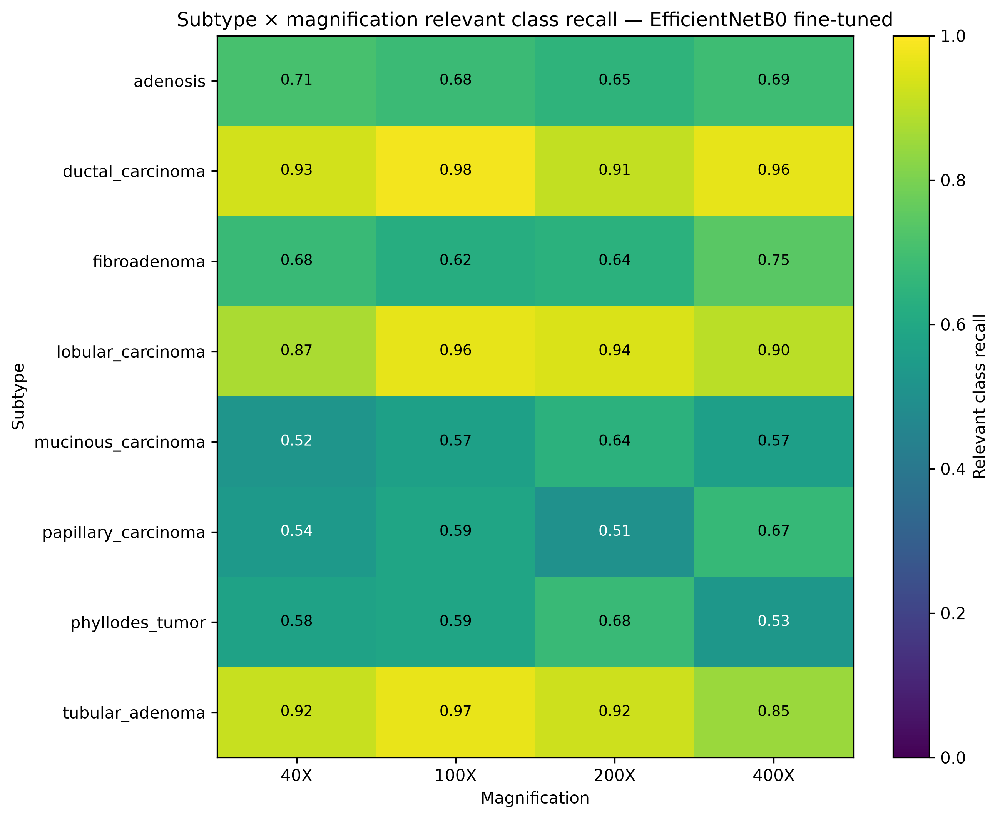
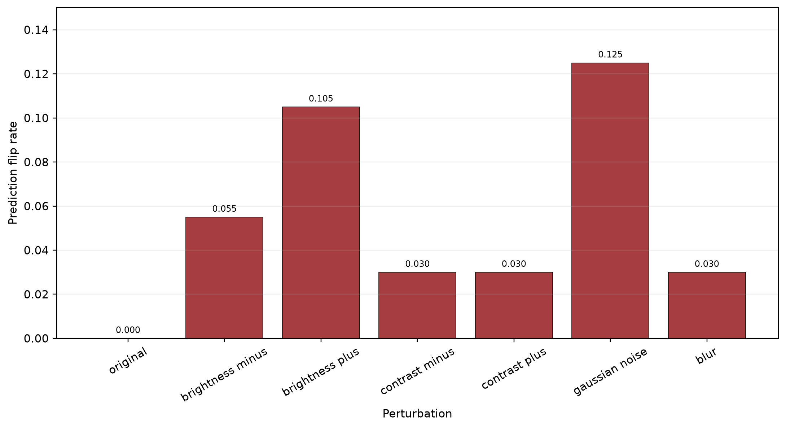

<p align="center">
  
</p>

# HistoBreastNet

**Classificazione deep learning di immagini istopatologiche del tumore mammario su BreakHis_v1**

HistoBreastNet è un progetto del corso di Deep Learning dedicato alla classificazione binaria di immagini istopatologiche in **benigne** e **maligne**. Il lavoro confronta una CNN baseline addestrata da zero con modelli di transfer learning, adotta una valutazione patient-wise e completa l'analisi con studi di robustezza e interpretabilità.

## Indice

- [Descrizione del progetto](#descrizione-del-progetto)
- [Domande di ricerca](#domande-di-ricerca)
- [Struttura della repository](#struttura-della-repository)
- [Dataset](#dataset)
- [Materiali esterni](#materiali-esterni)
- [Download dei materiali esterni](#download-dei-materiali-esterni)
- [Installazione](#installazione)
- [Esecuzione in Google Colab](#esecuzione-in-google-colab)
- [Ordine di esecuzione dei notebook](#ordine-di-esecuzione-dei-notebook)
- [Descrizione dei notebook](#descrizione-dei-notebook)
- [Risultati principali](#risultati-principali)
- [Interpretabilità e robustness](#interpretabilità-e-robustness)
- [Riproducibilità](#riproducibilità)
- [Team](#team)
- [Citazione del dataset](#citazione-del-dataset)

## Descrizione del progetto

Il progetto affronta la classificazione binaria benigno/maligno sul dataset istopatologico **BreakHis_v1**. I sottotipi tumorali non costituiscono il target predittivo principale, ma sono conservati nei metadati e impiegati nelle analisi di dettaglio D3.

La pipeline è articolata in cinque fasi:

1. creazione di un subset patient-level di circa 1,5–1,6 GB, mantenendo indivise tutte le immagini appartenenti allo stesso paziente;
2. generazione di split image-wise, patient-wise e k-fold patient-wise;
3. addestramento di una CNN baseline from scratch;
4. transfer learning con MobileNetV2 ed EfficientNetB0, sia con backbone congelato sia con fine-tuning;
5. analisi D3 per sottotipo, fattore di ingrandimento, paziente, tipologia di errore e confidence, seguita da Grad-CAM e test di robustezza a perturbazioni leggere.

Il protocollo finale è una **5-fold cross-validation patient-wise**. La separazione per paziente impedisce che immagini dello stesso soggetto compaiano contemporaneamente nei set di training e valutazione, offrendo una stima più realistica della generalizzazione su pazienti non visti.

## Domande di ricerca

### D1 — Transfer learning vs CNN baseline

> Il transfer learning migliora il trade-off tra efficacia predittiva ed efficienza computazionale rispetto a una CNN addestrata da zero?

Il confronto comprende CNN baseline, MobileNetV2 ed EfficientNetB0. Per i modelli pre-addestrati vengono valutate le modalità frozen e fine-tuned. Le metriche predittive principali sono accuracy, F1, AUROC e recall della classe maligna; l'efficienza è valutata attraverso tempo di training, tempo di inferenza, numero di parametri e dimensione del modello.

### D2 — Generalizzazione patient-wise

> Le performance rimangono affidabili su pazienti non visti?

Il notebook 02 confronta gli split image-wise e patient-wise e usa il k-fold patient-wise come protocollo principale. La pipeline controlla esplicitamente l'assenza di sovrapposizione dei pazienti tra training, validation e test.

### D3 — Robustezza e interpretabilità

> Il modello è robusto e interpretabile rispetto a sottotipi tumorali e fattori di ingrandimento?

L'analisi considera:

- metriche per sottotipo e magnification;
- falsi positivi e falsi negativi;
- distribuzione della confidence;
- risultati aggregati per paziente;
- mappe Grad-CAM;
- sensibilità a perturbazioni leggere delle immagini.

## Struttura della repository

La struttura seguente riassume i contenuti versionabili della repository senza riportare ogni singolo artefatto di run. La directory `data/` non è inclusa su GitHub e viene creata localmente o su Google Drive durante la preparazione dei dati.

```text
HistoBreastNet/
├── assets/
│   └── immagine_progetto.png
├── notebooks/
│   ├── 01_preprocessing.ipynb
│   ├── 02_baseline_cnn.ipynb
│   ├── 03_transfer_learning.ipynb
│   ├── 04_d3_error_analysis.ipynb
│   ├── 05_explainability_robustness.ipynb
│   ├── dataset_reduction.py
│   └── transfer_learning_utils.py
├── experiments/
│   ├── *_baseline_cnn_scratch_*/
│   ├── *_mobilenetv2_frozen_*/
│   ├── *_mobilenetv2_finetuned_*/
│   ├── *_efficientnetb0_frozen_*/
│   ├── *_efficientnetb0_finetuned_*/
│   └── .../model.keras
├── results/
│   ├── 02_baseline_cnn/
│   ├── 03_transfer_learning/
│   ├── 04_d3_error_analysis/
│   └── 05_explainability_robustness/
├── README.md
└── .gitignore
```

Directory esterna alla repository GitHub, generata dal notebook 01:

```text
data/
├── original/
└── processed/
    └── diversity_1p5GB/
```

Eventuali cartelle esplorative presenti nella copia di lavoro non fanno parte della pipeline finale descritta in questo documento.

## Dataset

| Proprietà | Dettaglio |
|---|---|
| Nome | BreakHis_v1 |
| Dominio | Istopatologia del tumore mammario |
| Task | Classificazione binaria benigno/maligno |
| Formato | Immagini RGB |
| Magnification | 40X, 100X, 200X, 400X |
| Sottotipi | adenosis, fibroadenoma, phyllodes tumor, tubular adenoma, ductal carcinoma, lobular carcinoma, mucinous carcinoma, papillary carcinoma |
| Split finale | 5-fold patient-wise |

Il dataset originale BreakHis_v1 non è incluso nella repository a causa delle sue dimensioni. L'intera cartella `data/` è esclusa dal versionamento Git: né `data/original/` né i file generati sotto `data/processed/` sono disponibili su GitHub.

La pipeline usa il subset `diversity_1p5GB`, costruito a livello di paziente. I risultati del preprocessing utilizzati negli esperimenti riportano **2.838 immagini appartenenti a 33 pazienti** (15 benigni e 18 maligni), per una dimensione effettiva di circa 1,59 GB decimali.

Il notebook `01_preprocessing.ipynb` genera localmente o su Google Drive la struttura seguente:

```text
data/processed/diversity_1p5GB/
├── metadata_subset.csv
├── image_wise_split.csv
├── patient_wise_split.csv
├── patient_wise_folds.csv
├── subset_manifest.csv
├── statistics.csv
└── images/
    └── histology_slides/
```

Questi file non sono inclusi nella repository GitHub. Devono essere generati eseguendo `01_preprocessing.ipynb` a partire dal dataset originale oppure forniti separatamente insieme alla cartella `data/processed/diversity_1p5GB/`.

## Materiali esterni

| Risorsa | Inclusa in GitHub? | Necessaria per | Note |
|---|---|---|---|
| BreakHis_v1 originale | No | `01_preprocessing.ipynb` | Dataset originale, non versionato per dimensioni |
| `data/processed/diversity_1p5GB/metadata_subset.csv` | No | Notebook 02, 03 ed eventualmente 04 | Metadati generati dal notebook 01 |
| `data/processed/diversity_1p5GB/*split*.csv` e `patient_wise_folds.csv` | No | Notebook 02 e 03 | Split e fold patient-wise generati dal notebook 01 |
| `data/processed/diversity_1p5GB/images/` | No | Notebook 02, 03 e 05 | Immagini del subset necessarie per training, inferenza e Grad-CAM |
| `results/` | Sì, dove presente | Consultazione dei risultati finali | Contiene CSV, tabelle e figure già generati |
| `model.keras` | Sì | `05_explainability_robustness.ipynb` | Modelli salvati in `experiments/`, necessari per rigenerare Grad-CAM e robustness |

> **Nota:** i CSV in `results/` sono output finali delle analisi, mentre i CSV in `data/processed/` sono input intermedi generati dal preprocessing. Poiché `data/` non è versionata, per rieseguire l'intera pipeline è necessario rigenerare o fornire separatamente `data/processed/diversity_1p5GB/`. I risultati versionati permettono di consultare tabelle e figure finali, ma non sostituiscono tutti gli input necessari alla riesecuzione.

Il notebook 04 lavora principalmente sulle predizioni e sui CSV aggregati e **non richiede modelli `.keras`**. Il notebook 05, invece, non effettua training ma richiede i cinque modelli EfficientNetB0 fine-tuned originali, uno per fold. I file `model.keras` sono ora versionati nella repository dentro `experiments/`, mantenendo la struttura originale delle run. In alternativa, possono essere rigenerati eseguendo `03_transfer_learning.ipynb` con `SAVE_MODELS = True`.

## Download dei materiali esterni

Anche se la repository contiene notebook, risultati, esperimenti e modelli `.keras`, la cartella `data/` non è versionata su GitHub. Per rieseguire la pipeline completa o per lavorare direttamente con il subset già preprocessato, sono disponibili i seguenti materiali esterni:

| Risorsa | Link | Contenuto |
|---|---|---|
| Google Drive del progetto | [Apri Google Drive](https://drive.google.com/drive/folders/1eM-R4AQQy5vURBJE0qSYfLdCh5T9zRiF?usp=sharing) | Copia completa/di supporto del progetto e degli artefatti condivisi |
| Cartella `data/` su OneDrive | [Scarica cartella data](https://unicadrsi-my.sharepoint.com/:f:/g/personal/j_bertucelli_studenti_unica_it/IgCaUIiJyQHqS7N7Wy_RND-rAcI49XwyykeJWWhH_2OphCg?e=hYzitE) | Cartella `data/` da copiare nella root del progetto |

Dopo il download, la cartella `data/` deve trovarsi nella root del progetto:

```text
HistoBreastNet/
├── data/
├── notebooks/
├── experiments/
├── results/
└── README.md
```

## Installazione

La repository include due file di dipendenze:

| File | Ambiente consigliato | Note |
|---|---|---|
| `requirements.txt` | Google Colab, Linux, ambienti standard | Include TensorFlow standard |
| `requirements-macos.txt` | Mac Apple Silicon | Usa `tensorflow-macos` e `tensorflow-metal` |

### Ambiente standard / Colab / Linux

```bash
python -m pip install --upgrade pip
pip install -r requirements.txt
```

### Mac Apple Silicon

Su Mac con chip Apple Silicon usare il file dedicato:

```bash
python -m pip install --upgrade pip
pip install -r requirements-macos.txt
```

Non installare `requirements.txt` e `requirements-macos.txt` nello stesso ambiente, perché il primo usa TensorFlow standard mentre il secondo usa `tensorflow-macos` con accelerazione `tensorflow-metal`.

### Esecuzione locale dei notebook

Per usare i notebook localmente:

```bash
jupyter notebook
```

oppure:

```bash
jupyter lab
```

Se si usa un ambiente virtuale o Conda, selezionare il kernel corretto all'interno di Jupyter.

TensorFlow è necessario soprattutto per i notebook `03_transfer_learning.ipynb` e `05_explainability_robustness.ipynb`.

## Esecuzione in Google Colab

I notebook includono una cella iniziale di configurazione che monta Google Drive, imposta la radice del progetto, cambia la directory di lavoro e indirizza gli output verso cartelle persistenti del progetto.

Configurazione di base:

```python
from google.colab import drive
drive.mount("/content/drive")

COLAB_PROJECT_ROOT = "/content/drive/MyDrive/HistoBreastNet"
```

Se la repository si trova in una sottocartella di Drive, aggiornare il percorso:

```python
COLAB_PROJECT_ROOT = "/content/drive/MyDrive/DeepLearning/HistoBreastNet"
```

La cella di setup assegna quindi `PROJECT_ROOT` e usa `os.chdir(PROJECT_ROOT)` o l'equivalente con `pathlib`. Tutti i percorsi operativi sono relativi a questa radice:

```text
data/
experiments/
results/
```

In questo modo dataset processati, log, predizioni, modelli e figure restano disponibili su Drive anche dopo la chiusura della sessione Colab.

## Ordine di esecuzione dei notebook

Se si parte dalla sola repository GitHub, la pipeline completa richiede prima il dataset originale BreakHis_v1 e l'esecuzione di `01_preprocessing.ipynb`, perché la cartella `data/` non è inclusa nella repository.

Se invece si dispone già della cartella `data/processed/diversity_1p5GB/` fornita separatamente, si possono rieseguire direttamente i notebook successivi.

### Pipeline 1 — Preprocessing e split

`notebooks/01_preprocessing.ipynb`

Crea il subset e tutti i file intermedi sotto `data/processed/diversity_1p5GB/`.

### Pipeline 2 — Baseline CNN e D2

`notebooks/02_baseline_cnn.ipynb`

Richiede i metadati, gli split e le immagini creati dal notebook 01.

### Pipeline 3 — Transfer learning e D1

`notebooks/03_transfer_learning.ipynb`

Richiede i file creati dal notebook 01, inclusi fold patient-wise e immagini del subset.

### Pipeline 4 — Error analysis quantitativa e D3

`notebooks/04_d3_error_analysis.ipynb`

Può usare principalmente i CSV di predizione disponibili in `results/`. Per una riesecuzione completa può richiedere metadati o informazioni di split da `data/processed/` qualora non siano già incorporati nelle predizioni.

### Pipeline 5 — Interpretabilità e robustness

`notebooks/05_explainability_robustness.ipynb`

Richiede le immagini in `data/processed/diversity_1p5GB/images/` e i cinque file `.keras` EfficientNetB0 fine-tuned associati ai fold.

Se i CSV di predizione e i risultati intermedi sono già disponibili, il notebook 04 può essere eseguito senza ripetere il training. Il notebook 05 non addestra modelli. Il notebook 03 è il passaggio più costoso dal punto di vista computazionale: evitare **Run All** se non si intende rilanciare l'intero training.

## Descrizione dei notebook

### `01_preprocessing.ipynb`

**Scopo**

- estrae e normalizza i metadati;
- crea un subset patient-level;
- conserva sottotipo e magnification;
- genera split image-wise, patient-wise e 5-fold patient-wise;
- crea la copia fisica delle immagini e i manifest associati.

**Input**

- dataset BreakHis_v1 originale, atteso sotto `data/original/`.

**Output principali**

```text
data/processed/diversity_1p5GB/metadata_subset.csv
data/processed/diversity_1p5GB/image_wise_split.csv
data/processed/diversity_1p5GB/patient_wise_split.csv
data/processed/diversity_1p5GB/patient_wise_folds.csv
data/processed/diversity_1p5GB/subset_manifest.csv
data/processed/diversity_1p5GB/statistics.csv
data/processed/diversity_1p5GB/images/
```

Gli output sotto `data/processed/` rimangono locali o su Drive e non sono inclusi nella repository GitHub.

### `02_baseline_cnn.ipynb`

**Scopo**

- definisce e addestra una CNN from scratch;
- costruisce la baseline per D1 e D2;
- confronta valutazione image-wise e patient-wise;
- esegue il k-fold patient-wise;
- salva metriche e predizioni della baseline.

**Input**

- metadati, split, fold e immagini sotto `data/processed/diversity_1p5GB/`, generati dal notebook 01 o forniti separatamente.

**Output principali**

```text
results/02_baseline_cnn/tables/
results/02_baseline_cnn/predictions/cnn_baseline_predictions.csv
experiments/*_baseline_cnn_scratch_*/
```

### `03_transfer_learning.ipynb`

**Scopo**

- valuta MobileNetV2 ed EfficientNetB0;
- confronta backbone frozen e fine-tuning;
- esegue la 5-fold cross-validation patient-wise;
- confronta i modelli transfer con la CNN baseline;
- produce tabelle e figure aggregate per D1.

**Input**

- metadati e fold patient-wise sotto `data/processed/diversity_1p5GB/`;
- immagini sotto `data/processed/diversity_1p5GB/images/`.

**Output principali**

```text
results/03_transfer_learning/tables/
results/03_transfer_learning/predictions/transfer_learning_predictions.csv
results/03_transfer_learning/figures/
experiments/*_mobilenetv2_*/
experiments/*_efficientnetb0_*/
```

Il modello transfer finale selezionato è **EfficientNetB0 fine-tuned originale**.

### `04_d3_error_analysis.ipynb`

**Scopo**

- svolge l'analisi quantitativa D3;
- calcola metriche per sottotipo e magnification;
- analizza falsi positivi, falsi negativi e confidence;
- aggrega i risultati per paziente;
- confronta opzionalmente baseline e miglior modello transfer.

**Input**

- principalmente CSV di predizione e risultati aggregati sotto `results/`;
- metadati o split sotto `data/processed/` se le informazioni necessarie non sono già contenute nelle predizioni.

**Output principali**

```text
results/04_d3_error_analysis/tables/
results/04_d3_error_analysis/figures/
results/04_d3_error_analysis/examples/
```

### `05_explainability_robustness.ipynb`

**Scopo**

- genera mappe Grad-CAM;
- seleziona esempi TP, TN, FP e FN;
- misura la robustezza a perturbazioni leggere;
- produce contact sheet riepilogative;
- carica il modello EfficientNetB0 fine-tuned specifico del fold.

**Input**

- immagini sotto `data/processed/diversity_1p5GB/images/`;
- predizioni necessarie alla selezione degli esempi;
- cinque modelli EfficientNetB0 fine-tuned fold-specific in formato `.keras`.

**Output principali**

```text
results/05_explainability_robustness/tables/
results/05_explainability_robustness/figures/gradcam/
results/05_explainability_robustness/figures/robustness/
results/05_explainability_robustness/figures/contact_sheets/
```

## Risultati principali

I risultati seguenti provengono dalla 5-fold cross-validation patient-wise. Ogni valore è riportato come **media ± deviazione standard tra i fold**; il tempo di inferenza è end-to-end per immagine.

| Modello | Modalità di training | Accuracy | F1 | AUROC | Recall maligno | Inferenza (ms/immagine) |
|---|---|---:|---:|---:|---:|---:|
| CNN baseline | From scratch | 0,699 ± 0,142 | 0,643 ± 0,213 | **0,836 ± 0,079** | 0,722 ± 0,358 | **0,561 ± 0,095** |
| MobileNetV2 | Frozen | 0,619 ± 0,066 | 0,600 ± 0,122 | 0,672 ± 0,092 | 0,616 ± 0,215 | 6,482 ± 1,826 |
| MobileNetV2 | Fine-tuned | 0,612 ± 0,070 | 0,599 ± 0,107 | 0,683 ± 0,087 | 0,611 ± 0,190 | 7,337 ± 2,232 |
| EfficientNetB0 | Frozen | 0,729 ± 0,087 | 0,720 ± 0,132 | 0,815 ± 0,106 | 0,763 ± 0,233 | 9,259 ± 2,403 |
| EfficientNetB0 | Fine-tuned | **0,746 ± 0,094** | **0,740 ± 0,127** | 0,827 ± 0,103 | **0,782 ± 0,215** | 10,487 ± 3,095 |

EfficientNetB0 fine-tuned è il miglior modello transfer per accuracy, F1 e recall maligno. La CNN baseline è molto più rapida in inferenza e, in questi esperimenti, ottiene anche la migliore AUROC media. Il risultato va quindi interpretato come un trade-off: EfficientNetB0 migliora diverse metriche predittive, ma richiede più tempo di training e inferenza. La variabilità tra fold resta rilevante e deve essere considerata nella lettura dei valori medi.

### Confronto metriche k-fold

<p align="center">
  
</p>

### Curve ROC

<p align="center">
  
</p>

### Confusion matrix: baseline vs EfficientNetB0 fine-tuned

<p align="center">
  
</p>

### Analisi per sottotipo

<p align="center">
  
</p>

### Sottotipo × magnification

<p align="center">
  
</p>

## Interpretabilità e robustness

Per ogni immagine, Grad-CAM viene generata usando il modello addestrato senza il fold a cui appartiene quell'immagine. L'analisi è quindi **out-of-fold** e comprende esempi true positive, true negative, false positive e false negative.

Le mappe forniscono un supporto qualitativo per osservare le regioni associate alla decisione del modello; non costituiscono una validazione clinica né una spiegazione causale definitiva.

<p align="center">
  
</p>

La robustezza viene valutata su perturbazioni leggere di brightness, contrast, rumore gaussiano e blur. Il notebook 05 salva predizioni, variazioni di probabilità, flip rate, accuratezza per perturbazione e contact sheet visuali. Sui risultati presenti sono stati analizzati 200 campioni con sei perturbazioni leggere più la condizione originale; il flip rate medio sulle perturbazioni è 0,0825 e la perturbazione più sensibile è il rumore gaussiano, con flip rate 0,135.

<p align="center">
  
</p>

## Riproducibilità

- I notebook sono numerati secondo l'ordine di esecuzione.
- I risultati finali e aggregati sono salvati in `results/` e, dove versionati, possono essere consultati senza rieseguire il training.
- Configurazioni, log, predizioni e artefatti delle singole run sono salvati in `experiments/`.
- L'intera cartella `data/`, inclusi i CSV intermedi prodotti dal notebook 01, non è versionata su GitHub.
- I file `.keras` sono versionati nella repository dentro `experiments/`; sono necessari per rigenerare Grad-CAM e robustness nel notebook 05.
- In Colab occorre impostare `COLAB_PROJECT_ROOT` sul percorso effettivo della repository.
- Per rigenerare Grad-CAM e robustness, il notebook 05 richiede i cinque modelli EfficientNetB0 fine-tuned originali.

### Riproduzione da repository GitHub

#### Scenario A — Riproduzione completa da zero

Richiede:

1. scaricare o preparare il dataset originale BreakHis_v1;
2. posizionarlo sotto `data/original/` secondo la struttura attesa dal notebook 01;
3. eseguire `notebooks/01_preprocessing.ipynb` per generare `data/processed/diversity_1p5GB/`;
4. eseguire in ordine i notebook dal 02 al 05.

Il notebook 03 rilancia il training transfer ed è il passaggio più oneroso. Il notebook 05 richiede inoltre i modelli `.keras` generati per i cinque fold.

#### Scenario B — Riproduzione dagli artefatti già generati

Richiede:

1. la repository GitHub;
2. la cartella `data/processed/diversity_1p5GB/` fornita separatamente, completa di CSV intermedi e immagini;
3. i file `model.keras` già presenti in `experiments/`, necessari per rieseguire il notebook 05.

I CSV, le tabelle e le figure già versionati in `results/` permettono di consultare gli output finali anche senza rigenerare il preprocessing e tutto il training. Non sostituiscono però `data/processed/diversity_1p5GB/` quando un notebook deve accedere ai metadati, agli split o alle immagini originali del subset.

Pattern dei modelli richiesti:

```text
experiments/*_diversity_1p5GB_kfold_patient_wise_efficientnetb0_finetuned_fold0/model.keras
experiments/*_diversity_1p5GB_kfold_patient_wise_efficientnetb0_finetuned_fold1/model.keras
experiments/*_diversity_1p5GB_kfold_patient_wise_efficientnetb0_finetuned_fold2/model.keras
experiments/*_diversity_1p5GB_kfold_patient_wise_efficientnetb0_finetuned_fold3/model.keras
experiments/*_diversity_1p5GB_kfold_patient_wise_efficientnetb0_finetuned_fold4/model.keras
```

Il notebook 04 non richiede i modelli `.keras`. Il notebook 05 richiede invece tutti e cinque i modelli indicati sopra per rigenerare Grad-CAM e robustness. Questi file sono ora presenti nella repository dentro `experiments/`, mantenendo la struttura originale delle fold. Se necessario, possono comunque essere rigenerati eseguendo `03_transfer_learning.ipynb` con `SAVE_MODELS = True`.

## Team

| Nome | Ruolo |
|---|---|
| Jacopo Bertucelli | Transfer learning, D1, D3, Grad-CAM e robustness |
| Enrico Molinari | Preprocessing, CNN baseline e D2 |

## Citazione del dataset

Il dataset BreakHis è stato utilizzato esclusivamente per finalità didattiche e sperimentali. Come indicato dalla pagina ufficiale del database, l’utilizzo del dataset per ricerca non commerciale richiede il riconoscimento della fonte tramite citazione del lavoro originale.

Il dataset è distribuito con licenza Creative Commons Attribution 4.0 International License (CC BY 4.0).

Riferimento bibliografico del dataset:

Spanhol, F. A., Oliveira, L. S., Petitjean, C., & Heutte, L. (2016).<br>
*A Dataset for Breast Cancer Histopathological Image Classification*.<br>
IEEE Transactions on Biomedical Engineering, 63(7), 1455–1462.

```bibtex
@article{spanhol2016dataset,
  title={A Dataset for Breast Cancer Histopathological Image Classification},
  author={Spanhol, Fabio A. and Oliveira, Luiz S. and Petitjean, Caroline and Heutte, Laurent},
  journal={IEEE Transactions on Biomedical Engineering},
  volume={63},
  number={7},
  pages={1455--1462},
  year={2016},
  publisher={IEEE}
}
```

Il progetto non ha finalità cliniche o diagnostiche ed è stato realizzato esclusivamente per un’attività didattica di Deep Learning.

## Ringraziamenti e limitazioni d'uso

Progetto realizzato nell'ambito del corso di Deep Learning, usando il dataset BreakHis_v1 per finalità didattiche e sperimentali.

HistoBreastNet è un progetto sperimentale: non è un dispositivo medico e non è destinato all'uso clinico o diagnostico.
